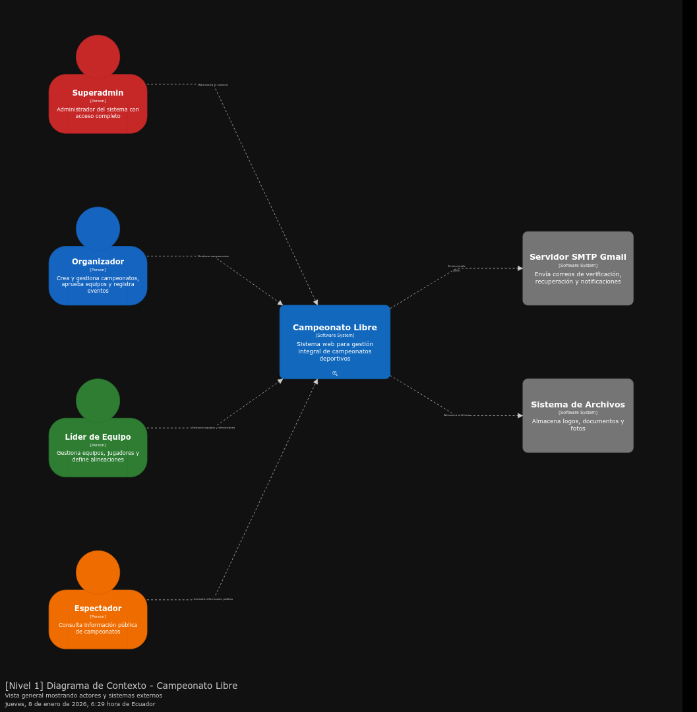

# Documentación Técnica - Campeonato Libre

## Introducción

Esta documentación técnica completa del sistema **Campeonato Libre** ha sido generada usando Quarto, una herramienta moderna para crear documentos técnicos y académicos.

## Requisitos Previos

Para compilar esta documentación, necesitas tener instalado:

1. **Quarto**: https://quarto.org/docs/get-started/
2. **R** (opcional, para algunas funciones): https://www.r-project.org/
3. **Pandoc** (incluido con Quarto)

### Instalación de Quarto

#### Linux

```bash
# Descargar e instalar
wget https://github.com/quarto-dev/quarto-cli/releases/download/v1.4.515/quarto-1.4.515-linux-amd64.deb
sudo dpkg -i quarto-1.4.515-linux-amd64.deb

# Verificar instalación
quarto --version
```

#### macOS

```bash
brew install --cask quarto
```

#### Windows

Descargar el instalador desde: https://quarto.org/docs/download/

## Estructura de la Documentación

```
docs/
├── _quarto.yml          # Configuración principal
├── index.qmd            # Portada e introducción
├── architecture/        # Arquitectura del sistema
│   ├── overview.qmd
│   ├── c4-context.qmd
│   ├── c4-containers.qmd
│   └── c4-components.qmd
├── backend/             # Backend
│   ├── api-gateway.qmd
│   ├── microservice.qmd
│   └── database.qmd
├── frontend/            # Frontend Web
│   ├── web-app.qmd
│   └── features.qmd
├── mobile/              # Aplicación Móvil
│   ├── overview.qmd
│   ├── architecture.qmd
│   ├── features.qmd
│   ├── maps-integration.qmd
│   └── voice-search.qmd
├── integration/         # Integración
│   ├── rest-api.qmd
│   ├── authentication.qmd
│   └── error-handling.qmd
├── deployment/          # Despliegue
│   ├── backend.qmd
│   ├── frontend.qmd
│   └── mobile.qmd
├── user-guide/          # Guías de Usuario
│   ├── web-admin.qmd
│   ├── web-organizer.qmd
│   └── mobile-user.qmd
└── testing/             # Testing
    ├── integration-tests.qmd
    └── performance.qmd
```

## Compilación

### Compilar a HTML

```bash
cd docs
quarto render
```

El resultado se generará en `docs/_book/`

### Compilar a PDF

```bash
cd docs
quarto render --to pdf
```

El PDF se generará en `docs/_book/Campeonato-Libre-Documentacion-Tecnica.pdf`

### Compilar solo HTML

```bash
cd docs
quarto render --to html
```

### Compilar solo PDF

```bash
cd docs
quarto render --to pdf
```

## Visualización Local

### HTML

Después de compilar a HTML, puedes abrir el archivo:

```bash
# Abrir en navegador
xdg-open docs/_book/index.html  # Linux
open docs/_book/index.html       # macOS
start docs/_book/index.html      # Windows
```

O usar el servidor de desarrollo de Quarto:

```bash
cd docs
quarto preview
```

Esto iniciará un servidor local en `http://localhost:4200` (o puerto disponible).

## Personalización

### Modificar Tema

Edita `_quarto.yml` y cambia el tema:

```yaml
format:
  html:
    theme: cosmo  # Opciones: cosmo, flatly, journal, etc.
```

### Agregar Contenido

1. Crea un nuevo archivo `.qmd` en la carpeta correspondiente
2. Agrega la referencia en `_quarto.yml` en la sección `chapters`
3. Recompila la documentación

### Modificar Estilo PDF

Edita la sección `pdf` en `_quarto.yml`:

```yaml
format:
  pdf:
    documentclass: article
    geometry:
      - top=30mm
      - left=20mm
    fontsize: 11pt
```

## Solución de Problemas

### Error: "Quarto no encontrado"

Asegúrate de que Quarto esté instalado y en el PATH:

```bash
which quarto
quarto --version
```

### Error al compilar PDF

Para compilar PDF necesitas tener instalado LaTeX:

- **Linux**: `sudo apt-get install texlive-full`
- **macOS**: `brew install --cask mactex`
- **Windows**: Instalar MiKTeX

### Error con imágenes

Asegúrate de que las rutas de las imágenes sean relativas a la carpeta `docs/`:

```markdown

```

## Exportación para Presentación

### PDF para Presentación

1. Compila a PDF:
   ```bash
   quarto render --to pdf
   ```

2. El PDF estará en: `docs/_book/Campeonato-Libre-Documentacion-Tecnica.pdf`

### HTML para Presentación

1. Compila a HTML:
   ```bash
   quarto render --to html
   ```

2. Abre `docs/_book/index.html` en navegador
3. Usa "Imprimir" → "Guardar como PDF" para exportar páginas específicas

## Actualización de Contenido

Para actualizar la documentación:

1. Edita los archivos `.qmd` correspondientes
2. Recompila:
   ```bash
   quarto render
   ```

## Recursos Adicionales

- **Documentación de Quarto**: https://quarto.org/docs/
- **Guía de Markdown**: https://quarto.org/docs/authoring/markdown-basics.html
- **Temas HTML**: https://quarto.org/docs/output-formats/html-themes.html

## Contacto

Para preguntas sobre la documentación o el sistema:

- **Autor**: Cesar Ramos
- **Repositorio**: https://github.com/cesar050/Campeonato

---

**Última actualización**: 2026
