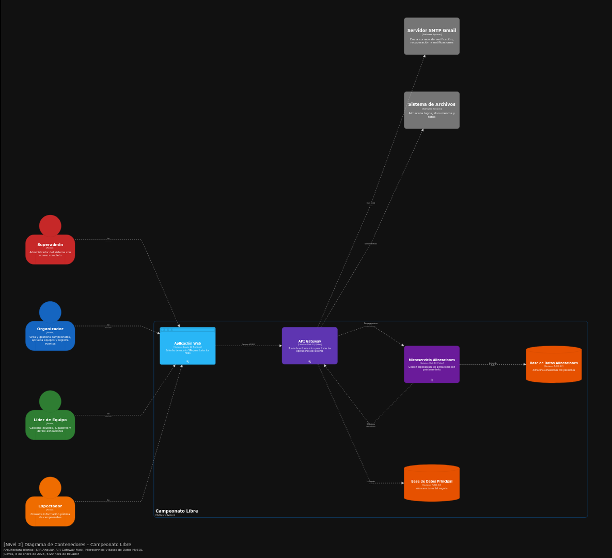

# Diagrama de Contenedores C4 - Nivel 2

## Introducción

El diagrama de contenedores muestra los contenedores (aplicaciones, servicios, bases de datos) que conforman el sistema y cómo se comunican entre sí.

## Diagrama de Contenedores

```{=html}
<div class="figure">

<p class="caption">Figura 2: [Nivel 2] Diagrama de Contenedores - Sistema Multiplataforma</p>
</div>
```

## Contenedores del Sistema

### 1. Aplicación Web (Angular SPA)

**Tecnología:** Angular 21, TypeScript, Angular Material

**Responsabilidades:**
- Interfaz de usuario para administradores, organizadores y líderes
- Gestión de campeonatos, equipos, jugadores
- Visualización de estadísticas y reportes
- Sistema de notificaciones en tiempo real

**Características:**
- Single Page Application (SPA)
- Routing con guards de autenticación
- Estado reactivo con RxJS
- Componentes reutilizables con Angular Material
- Lazy loading de módulos

**Comunicación:**
- Se comunica con el API Gateway mediante HTTP/REST
- Consume endpoints autenticados con JWT tokens

**Puerto:** 4200 (desarrollo)

### 2. Aplicación Móvil Android (React Native)

**Tecnología:** React Native 0.83.1, TypeScript

**Responsabilidades:**
- Interfaz para espectadores
- Visualización de campeonatos activos
- Tabla de posiciones en tiempo real
- Calendario de partidos
- Mapa interactivo de estadios
- Búsqueda por voz de partidos

**Características:**
- Aplicación nativa multiplataforma
- Integración con Google Maps
- Reconocimiento de voz local
- Manejo robusto de errores
- Estados de carga y vacíos

**Comunicación:**
- Se comunica con API Gateway mediante HTTP/REST
- Consume endpoints públicos (sin autenticación)
- Integración con Google Maps API para mapas
- Reconocimiento de voz local (no requiere servidor)

**Plataforma:** Android (APK disponible)

### 3. API Gateway (Flask Application)

**Tecnología:** Flask 3.0, Python 3.12, Flask-RESTx

**Responsabilidades:**
- Punto de entrada único para todas las peticiones
- Autenticación y autorización (JWT)
- Enrutamiento a servicios backend
- Rate limiting y protección de seguridad
- Manejo de archivos (upload/download)
- Proxy a microservicios

**Características:**
- API REST documentada con Swagger
- Autenticación JWT con refresh tokens
- Rate limiting por IP y usuario
- Account lockout después de intentos fallidos
- Validación y sanitización de entrada
- CORS configurado
- Proxy hacia microservicio de alineaciones

**Comunicación:**
- Recibe peticiones del Frontend Web y App Móvil
- Se comunica con Base de Datos mediante SQLAlchemy
- Se comunica con Microservicio de Alineaciones mediante HTTP/REST
- Envía emails mediante SMTP

**Puerto:** 5000

### 4. Microservicio de Alineaciones

**Tecnología:** Flask 3.0, Python

**Responsabilidades:**
- Gestión especializada de alineaciones de partidos
- Validación de reglas de negocio para alineaciones
- Procesamiento de eventos de partidos relacionados con alineaciones

**Características:**
- Servicio independiente y desacoplado
- Puede escalarse independientemente
- Comunicación REST con API Gateway
- Validación de datos con Gateway

**Comunicación:**
- Recibe peticiones del API Gateway (proxy)
- Consulta datos del API Gateway para validaciones
- Accede a Base de Datos de alineaciones

**Puerto:** 5001

### 5. Base de Datos Principal (MySQL)

**Tecnología:** MySQL 8.0

**Responsabilidades:**
- Almacenamiento persistente de todos los datos del sistema
- Coordenadas GPS para estadios
- Relaciones entre entidades
- Integridad referencial

**Características:**
- Base de datos relacional
- Soporte para coordenadas geográficas (latitud/longitud)
- Índices optimizados para consultas frecuentes
- Backup automático configurado

**Puerto:** 3306 (default)

### 6. Base de Datos Alineaciones (MySQL)

**Tecnología:** MySQL 8.0

**Responsabilidades:**
- Almacenamiento de alineaciones con posiciones
- Datos de cambios durante partidos

**Puerto:** 3306 (puede ser la misma instancia o separada)

## Flujos de Comunicación

### Flujo 1: Login de Usuario Web

```
Usuario → Frontend Web → API Gateway → Base de Datos
```

### Flujo 2: Consulta de Campeonatos (App Móvil)

```
Espectador → App Móvil → API Gateway → Base de Datos
```

### Flujo 3: Gestión de Alineaciones

```
Líder → Frontend Web → API Gateway → Proxy → Microservicio → Base de Datos Alineaciones
```

### Flujo 4: Visualización de Mapa de Estadios

```
Espectador → App Móvil → API Gateway → Base de Datos (coordenadas) → Google Maps API
```

## Próximos Pasos

Para ver los componentes internos de cada contenedor, consulte:

- [Diagrama de Componentes C4 - Nivel 3](c4-components.qmd)
