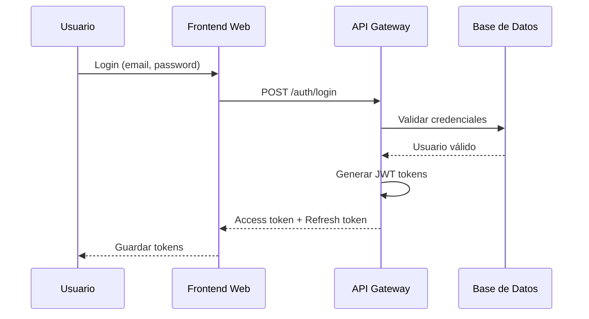
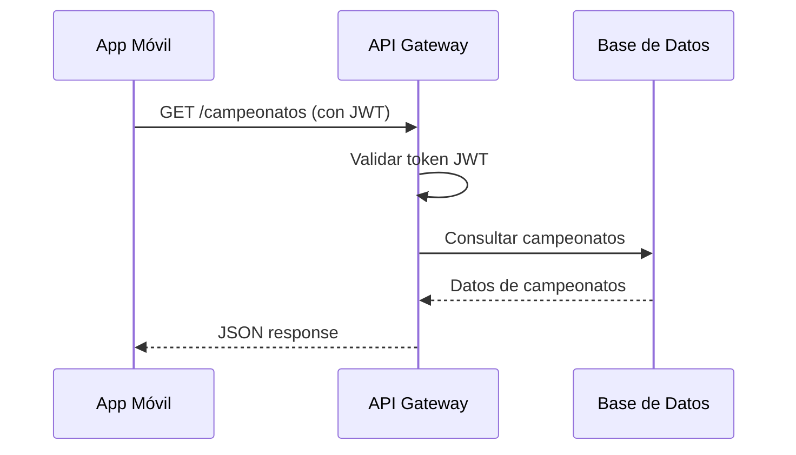
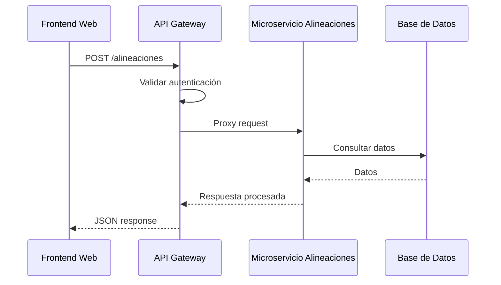

# Visión General de la Arquitectura

## Introducción

El sistema **Campeonato Libre** está diseñado siguiendo una arquitectura de microservicios con un API Gateway central. Esta arquitectura permite escalabilidad, mantenibilidad y separación de responsabilidades entre los diferentes componentes del sistema.

## Principios Arquitectónicos

### 1. Separación de Responsabilidades

Cada componente del sistema tiene una responsabilidad específica y bien definida:

- **Frontend Web**: Interfaz de usuario para administradores y organizadores
- **API Gateway**: Punto de entrada único, autenticación y enrutamiento
- **Microservicio de Alineaciones**: Lógica especializada para gestión de alineaciones
- **Base de Datos**: Almacenamiento persistente de datos
- **App Móvil**: Interfaz para espectadores con funcionalidades específicas

### 2. API-First Design

El sistema está diseñado con un enfoque API-first, donde:

- Todos los componentes se comunican a través de APIs REST
- La documentación de la API se genera automáticamente (Swagger)
- Los contratos de API están bien definidos y versionados

### 3. Seguridad por Capas

La seguridad se implementa en múltiples capas:

- **Autenticación**: JWT tokens con refresh tokens
- **Autorización**: Sistema de roles y permisos granular
- **Rate Limiting**: Protección contra abuso de API
- **Account Lockout**: Protección contra ataques de fuerza bruta
- **Validación de Entrada**: Sanitización y validación de datos

### 4. Escalabilidad Horizontal

La arquitectura permite escalar componentes individuales según la demanda:

- El API Gateway puede escalarse independientemente
- El microservicio de alineaciones puede escalarse por separado
- La base de datos puede replicarse para lectura

## Componentes del Sistema

### Frontend Web (Angular 21)

**Responsabilidades:**
- Interfaz de usuario para administradores
- Gestión de campeonatos, equipos y jugadores
- Visualización de estadísticas y reportes
- Sistema de notificaciones

**Tecnologías:**
- Angular 21 con TypeScript
- Angular Material para componentes UI
- RxJS para manejo de estado reactivo
- Guards para protección de rutas

### API Gateway (Flask)

**Responsabilidades:**
- Punto de entrada único para todas las peticiones
- Autenticación y autorización centralizada
- Enrutamiento a servicios backend
- Rate limiting y protección de seguridad
- Manejo de archivos (logos, fotos)

**Tecnologías:**
- Flask 3.1.0 con Python 3.12
- Flask-RESTx para documentación API
- Flask-JWT-Extended para autenticación
- Flask-CORS para CORS
- SQLAlchemy para ORM

### Microservicio de Alineaciones

**Responsabilidades:**
- Gestión especializada de alineaciones de partidos
- Validación de reglas de negocio para alineaciones
- Procesamiento de eventos de partidos

**Tecnologías:**
- Flask (microservicio independiente)
- Comunicación REST con API Gateway

### Base de Datos (MySQL 8.0)

**Responsabilidades:**
- Almacenamiento persistente de datos
- Coordenadas GPS para estadios
- Relaciones entre entidades
- Integridad referencial

**Características:**
- MySQL 8.0
- Coordenadas geográficas (latitud/longitud)
- Índices optimizados para consultas frecuentes
- Backup automático

### Aplicación Móvil (React Native)

**Responsabilidades:**
- Interfaz para espectadores
- Visualización de campeonatos y partidos
- Integración con Google Maps
- Búsqueda por voz
- Consumo de API REST

**Tecnologías:**
- React Native 0.83.1
- TypeScript
- react-native-maps para mapas
- @react-native-community/voice para reconocimiento de voz
- Axios para peticiones HTTP

## Flujo de Datos

### Flujo de Autenticación

### Flujo de Consulta de Datos

### Flujo de Microservicio

## Patrones Arquitectónicos

### 1. API Gateway Pattern

El API Gateway actúa como punto de entrada único, proporcionando:

- **Unificación**: Un solo punto de acceso para todos los clientes
- **Seguridad**: Autenticación y autorización centralizada
- **Enrutamiento**: Distribución de peticiones a servicios backend
- **Transformación**: Adaptación de respuestas según el cliente

### 2. Microservicios

El microservicio de alineaciones demuestra:

- **Separación de Responsabilidades**: Lógica especializada aislada
- **Escalabilidad Independiente**: Puede escalarse según demanda
- **Tecnología Específica**: Puede usar tecnologías optimizadas

### 3. Repository Pattern

En el backend se utiliza el patrón Repository para:

- **Abstracción de Datos**: Separar lógica de negocio de acceso a datos
- **Testabilidad**: Facilita pruebas unitarias
- **Mantenibilidad**: Cambios en BD no afectan lógica de negocio

### 4. MVC (Model-View-Controller)

En el frontend Angular:

- **Model**: Servicios y modelos de datos
- **View**: Componentes y templates
- **Controller**: Lógica de componentes y servicios

## Decisiones Arquitectónicas

### Decisión 1: API Gateway Centralizado

**Justificación:**
- Simplifica la gestión de autenticación
- Centraliza políticas de seguridad
- Facilita el monitoreo y logging

**Alternativas Consideradas:**
- Autenticación distribuida en cada servicio
- Descartada por complejidad de gestión

### Decisión 2: JWT para Autenticación

**Justificación:**
- Stateless: No requiere sesiones en servidor
- Escalable: Funciona bien en arquitectura distribuida
- Seguro: Firmado y con expiración

**Alternativas Consideradas:**
- Sesiones tradicionales
- OAuth 2.0
- Descartadas por complejidad o limitaciones

### Decisión 3: MySQL para Base de Datos

**Justificación:**
- Relacional: Perfecto para datos estructurados
- Maduro: Amplia comunidad y documentación
- Soporte Geográfico: Coordenadas GPS nativas

**Alternativas Consideradas:**
- PostgreSQL
- MongoDB
- Descartadas por requerimientos específicos

### Decisión 4: React Native para App Móvil

**Justificación:**
- Multiplataforma: Un solo código para Android e iOS
- Performance: Código nativo para operaciones críticas
- Ecosistema: Amplia comunidad y librerías

**Alternativas Consideradas:**
- Flutter
- Nativas (Kotlin/Swift)
- Descartadas por tiempo de desarrollo o curva de aprendizaje

## Escalabilidad

### Escalabilidad Vertical

- Aumentar recursos (CPU, RAM) de servidores existentes
- Aplicable a: API Gateway, Base de Datos

### Escalabilidad Horizontal

- Agregar más instancias de servicios
- Aplicable a: API Gateway, Microservicio de Alineaciones
- Requiere: Load balancer, sesiones stateless

### Estrategias de Caché

- Caché de consultas frecuentes (tabla de posiciones)
- Caché de tokens JWT validados
- CDN para archivos estáticos (logos, fotos)

## Seguridad

### Capas de Seguridad

1. **Red**: Firewall, VPN (si aplica)
2. **Aplicación**: Autenticación, autorización, validación
3. **Datos**: Encriptación en tránsito (HTTPS), en reposo (opcional)
4. **Código**: Sanitización de entrada, protección SQL injection

### Medidas Implementadas

- ✅ Autenticación JWT con refresh tokens
- ✅ Rate limiting por IP y usuario
- ✅ Account lockout después de intentos fallidos
- ✅ Validación y sanitización de entrada
- ✅ CORS configurado correctamente
- ✅ Passwords hasheados con bcrypt

## Monitoreo y Logging

### Logging

- Logs de autenticación (éxitos y fallos)
- Logs de operaciones críticas
- Logs de errores con stack traces
- Logs de seguridad (intentos de acceso no autorizado)

### Métricas

- Tiempo de respuesta de endpoints
- Tasa de error por endpoint
- Uso de recursos (CPU, memoria)
- Número de usuarios activos

## Próximos Pasos

Para profundizar en la arquitectura, consulte:

- [Diagrama de Contexto C4](c4-context.qmd)
- [Diagrama de Contenedores C4](c4-containers.qmd)
- [Diagrama de Componentes C4](c4-components.qmd)
