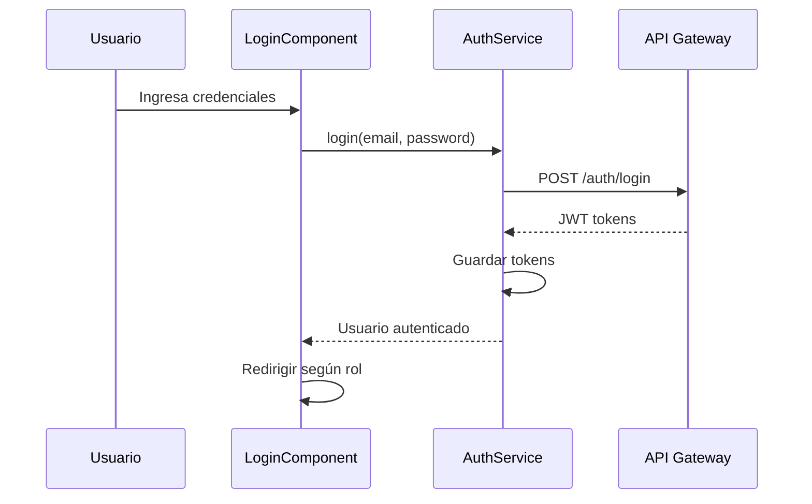
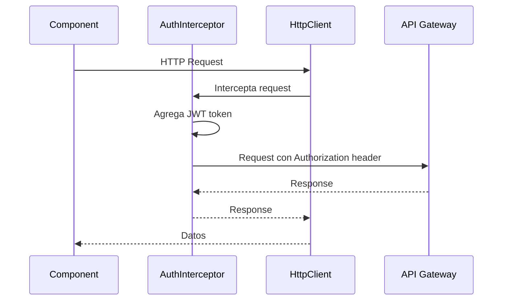

# Aplicación Web Angular

## Introducción

La aplicación web **Campeonato Libre** está construida con Angular 21 y proporciona una interfaz administrativa completa para gestionar campeonatos, equipos, jugadores y partidos.

## Tecnologías

- **Framework**: Angular 21.0.0
- **Lenguaje**: TypeScript 5.9.2
- **UI Framework**: Angular Material 21.0.2
- **Estado**: RxJS 7.8.0
- **Routing**: Angular Router 21.0.0
- **HTTP**: HttpClient con interceptors

## Estructura del Proyecto

```
frontend/src/app/
├── app.ts                    # Componente raíz
├── app.routes.ts            # Configuración de rutas
├── app.config.ts            # Configuración de la aplicación
├── core/                    # Módulos core
│   ├── guards/              # Route guards
│   │   ├── auth.guard.ts
│   │   ├── organizador.guard.ts
│   │   └── lider.guard.ts
│   ├── interceptors/        # HTTP interceptors
│   │   └── auth.interceptor.ts
│   ├── services/            # Servicios core
│   │   ├── auth.service.ts
│   │   └── perfil.service.ts
│   └── models/              # Modelos de datos
│       └── usuario.model.ts
├── features/                # Módulos por feature
│   ├── auth/                # Autenticación
│   │   └── components/
│   │       ├── login/
│   │       ├── register/
│   │       └── unlock-account/
│   ├── superadmin/          # Módulo Superadmin
│   │   ├── components/
│   │   │   ├── dashboard/
│   │   │   └── sidebar/
│   │   └── services/
│   ├── organizador/         # Módulo Organizador
│   │   ├── components/
│   │   │   ├── campeonatos/
│   │   │   ├── equipos/
│   │   │   ├── partidos/
│   │   │   └── sidebar/
│   │   └── services/
│   ├── lider-equipo/        # Módulo Líder
│   │   ├── components/
│   │   │   ├── alineaciones/
│   │   │   ├── equipos/
│   │   │   └── jugadores/
│   │   └── services/
│   ├── dashboard/           # Dashboard principal
│   ├── landing/             # Landing page
│   └── perfil/              # Perfil de usuario
└── shared/                   # Componentes compartidos
    └── components/
```

## Arquitectura de Componentes

### 1. SPA Router (Angular Router)

**Responsabilidad**: Enrutamiento y navegación entre módulos.

**Configuración**: `app.routes.ts`

```typescript
export const routes: Routes = [
  { path: '', loadComponent: () => import('./features/landing/landing.component') },
  { path: 'auth/login', loadComponent: () => import('./features/auth/components/login/login.component') },
  { path: 'superadmin', loadComponent: () => import('./features/superadmin/superadmin.component'), canActivate: [superadminGuard] },
  { path: 'organizador', loadComponent: () => import('./features/organizador/organizador.component'), canActivate: [organizadorGuard] },
  { path: 'lider', loadComponent: () => import('./features/lider-equipo/lider-equipo.component'), canActivate: [liderGuard] },
];
```

**Características**:
- Lazy loading de componentes
- Guards de autenticación y autorización
- Rutas protegidas por rol

### 2. Módulo de Autenticación

**Componentes**:
- `LoginComponent`: Inicio de sesión
- `RegisterComponent`: Registro de usuarios
- `UnlockAccountComponent`: Desbloqueo de cuenta

**Funcionalidades**:
- Login con email y contraseña
- Registro con validación de email
- Recuperación de contraseña
- Desbloqueo de cuenta con código

### 3. Módulo Superadmin

**Componentes**:
- `DashboardComponent`: Dashboard con estadísticas
- `SidebarComponent`: Navegación lateral

**Funcionalidades**:
- Gestión de organizadores
- Supervisión de campeonatos
- Configuración global del sistema

### 4. Módulo Organizador

**Componentes**:
- Gestión de campeonatos (crear, editar, listar)
- Gestión de equipos (aprobar/rechazar)
- Gestión de partidos (programar, registrar resultados)
- Gestión de alineaciones (ver, validar)

**Funcionalidades**:
- Crear y gestionar campeonatos
- Aprobar/rechazar inscripciones de equipos
- Generar fixtures automáticamente
- Registrar resultados de partidos
- Validar alineaciones antes de iniciar partidos

### 5. Módulo Líder

**Componentes**:
- `AlineacionesComponent`: Gestión de alineaciones con drag & drop
- Gestión de equipos
- Gestión de jugadores

**Funcionalidades**:
- Definir alineaciones con posicionamiento
- Gestionar jugadores del equipo
- Ver estadísticas del equipo
- Solicitar inscripción a campeonatos

### 6. Módulo Público

**Componentes**:
- `LandingComponent`: Página de inicio
- `BienvenidoComponent`: Página de bienvenida
- `SobreNosotrosComponent`: Información del sistema
- `PreciosComponent`: Planes y precios

## Capa de Comunicación HTTP

### HTTP Client Layer

**Implementación**: `HttpClient` de Angular con interceptors.

**Configuración**: `app.config.ts`

```typescript
export const appConfig: ApplicationConfig = {
  providers: [
    provideHttpClient(withInterceptors([authInterceptor]))
  ]
};
```

### Auth Interceptor

**Archivo**: `core/interceptors/auth.interceptor.ts`

**Funcionalidad**:
- Inyección automática de JWT token en todas las peticiones
- Manejo de errores 401 (redirige a login)
- Refresh token automático

**Implementación**:
```typescript
export const authInterceptor: HttpInterceptorFn = (req, next) => {
  const authService = inject(AuthService);
  const token = authService.getAccessToken();
  
  if (token) {
    req = req.clone({
      setHeaders: {
        Authorization: `Bearer ${token}`
      }
    });
  }
  
  return next(req);
};
```

## Capa de Seguridad

### Security Guards

**Guards Implementados**:

1. **AuthGuard** (`auth.guard.ts`):
   - Verifica autenticación
   - Redirige a login si no está autenticado

2. **SuperadminGuard** (`auth.guard.ts`):
   - Verifica rol `superadmin`
   - Redirige si no tiene permisos

3. **OrganizadorGuard** (`organizador.guard.ts`):
   - Verifica rol `admin` o `superadmin`
   - Protege rutas de organizador

4. **LiderGuard** (`lider.guard.ts`):
   - Verifica rol `lider`
   - Protege rutas de líder

**Uso en Rutas**:
```typescript
{
  path: 'organizador',
  loadComponent: () => import('./features/organizador/organizador.component'),
  canActivate: [organizadorGuard]
}
```

## Servicios Principales

### AuthService

**Archivo**: `core/services/auth.service.ts`

**Métodos**:
- `login(email, password)`: Iniciar sesión
- `register(data)`: Registrar usuario
- `logout()`: Cerrar sesión
- `getAccessToken()`: Obtener token JWT
- `refreshToken()`: Renovar token
- `isAuthenticated()`: Verificar autenticación
- `getCurrentUser()`: Obtener usuario actual

### PerfilService

**Archivo**: `core/services/perfil.service.ts`

**Funcionalidad**: Gestión del perfil de usuario

## Flujo de Autenticación



## Flujo de Petición HTTP



## Características Principales

### 1. Lazy Loading

Todos los módulos se cargan bajo demanda:
- Mejora el tiempo de carga inicial
- Reduce el tamaño del bundle inicial
- Mejor experiencia de usuario

### 2. Guards de Seguridad

Protección de rutas por rol:
- Autenticación requerida
- Autorización basada en roles
- Redirección automática

### 3. Interceptors HTTP

- Inyección automática de tokens
- Manejo centralizado de errores
- Refresh token automático

### 4. Componentes Reutilizables

En `shared/components/`:
- Componentes UI compartidos
- Directivas personalizadas
- Pipes personalizados

## Próximos Pasos

Para más detalles sobre:
- Funcionalidades: [Features](features.qmd)
